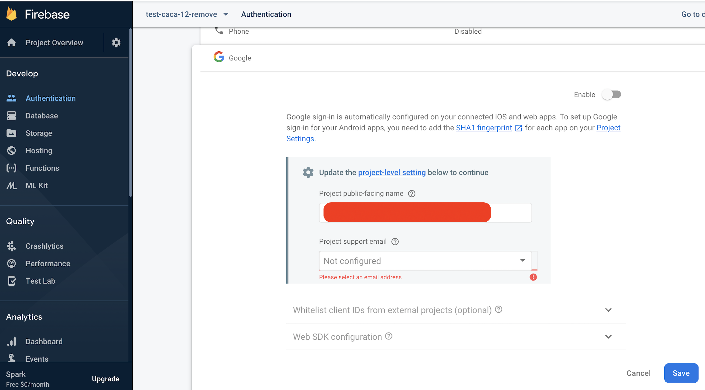
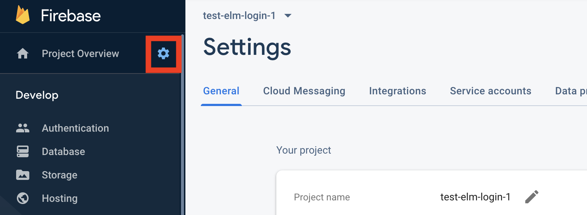

# Elm Firebase

A simple repository to show Elm integration with Firebase using ports. You can read more about it in my [short blog post introducing it](https://lengrand.fr/using-firebase-in-elm/).

You can demo the app **[here](https://elm-firebase.netlify.com/)**.

This demo runs on **[Elm 0.19](https://elm-lang.org)**.

## Getting started

To run this app locally, you will need to :

- Set up your [Firebase Cloud Firestore](https://firebase.google.com/docs/firestore) to handle and receive users and messages.
- Be able to run this repository

### Setting up the Database and Auth

- Go to the [Firebase console](https://console.firebase.google.com/?pli=1) and create a new project
- Setup Google Signin in the Authentication part.



- Create a new Cloud Firestore in locked mode
- Change the Firestore rules so that only logged requests can be written / read.

```
rules_version = '2';
service cloud.firestore {
  match /databases/{database}/documents {
		match /users/{userId}/messages/{messageId} {
      allow create, read, update, delete: if request.auth.uid == userId;
    }
  }
}
```

Using those rules, each user will get its own space, with a messages store inside it. So this doubles down as database setup, and security.

That should be it! If needed, test your rules using the [Simulator](https://firebase.google.com/docs/firestore/security/get-started#testing_rules).

### Running the code

To run the code, only a few steps are needed :).

- Clone the repo : `$ git clone git@github.com:jlengrand/elm-firebase.git`
- Move in the repo : `$ cd elm-firebase`
- Install necessary dependencies. The easiest way is probably to run `$ npm install`.
- You will need to create a `.env` file in your root folder to let the app know about your Firestore project. The `.env` file looks like this :

```
ELM_APP_API_KEY="AIzaSyCjjxds-Qrk2Vsjj8qktPuzEgwerggeg"
ELM_APP_AUTH_DOMAIN="test-elm-login-elererge.firebaseapp.com"
ELM_APP_DATABASE_URL="https://test-elm-login-elererge.firebaseio.com"
ELM_APP_PROJECT_ID="test-elm-login-elererge"
ELM_APP_STORAGE_BUCKET=""
ELM_APP_MESSAGING_SENDER_ID="916631954567"
ELM_APP_APP_ID="1:916631954567:web:2a755b103fe23041"
```

The required information is the same as described in the [Firebase config object](https://firebase.google.com/docs/web/setup#config-object).
The easiest way is to go to the settings page of your project, and scroll down until you see the javascript snippet. It will contain all the information needed.

_Note : All the informationm in the .env file is not secret, and can be shared. In fact, it will be accessible to anyone using your app via the console. [This is not a problem](https://stackoverflow.com/questions/37482366/is-it-safe-to-expose-firebase-apikey-to-the-public)!_



- Run the app : `$ npm start`. You will be able to test the app at `http://localhost:3000`!

### Deploying

If for some reason you want to deploy the code somewhere, you can run `$ npm run build`. Now you simply have to serve the content of the `build` folder, and you're done!

## Contributing

Contributions are more than welcome ! You can [pick one of the issues of the list](https://github.com/jlengrand/elm-firebase/issues) or simply create your own :).

## Authors

* [Julien Lengrand-Lambert](https://twitter.com/jlengrand)

Happy hacking!
